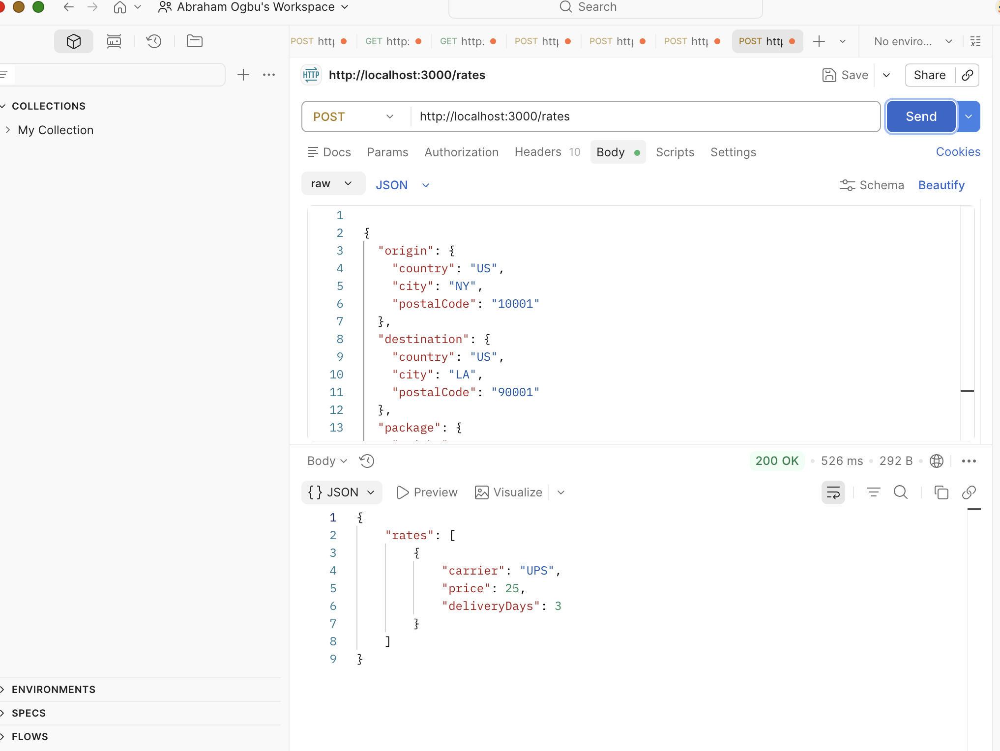
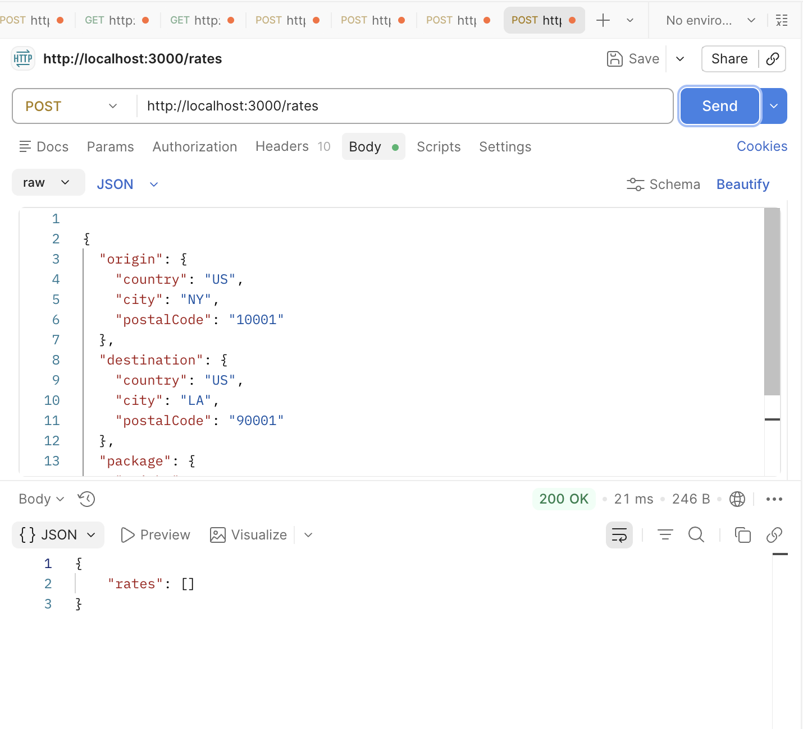
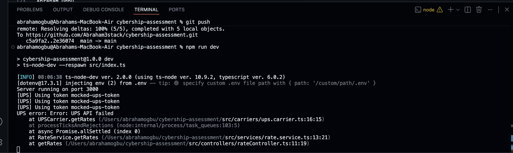

Abraham Ogbu
# Cybership Backend Assessment

## Overview

This project implements a modular and extensible backend service for retrieving shipping rates from multiple carriers. It simulates integration with external APIs such as UPS while maintaining clean architecture and scalability.

---

## Tech Stack

- Node.js  
- TypeScript  
- Express  
- Zod  

---

## Architecture

The system is designed with separation of concerns:

- **Controllers** → Handle HTTP requests and validation  
- **Services** → Business logic and orchestration  
- **Carriers** → External API integrations (UPS, future FedEx, etc.)  
- **Utils** → Validation and helpers  

This ensures new carriers can be added without modifying existing logic.

---

## Features

- Input validation using Zod  
- Carrier abstraction using interfaces  
- OAuth token simulation with caching  
- Resilient API handling with graceful fallbacks  
- Concurrent rate fetching using Promise.allSettled  

---

## How to Run

```bash
npm install
npm run dev
```

Server runs at:  
http://localhost:3000/

---

## API Endpoint

### POST /rates

#### Request

```json
{
  "origin": {
    "country": "US",
    "city": "NY",
    "postalCode": "10001"
  },
  "destination": {
    "country": "US",
    "city": "LA",
    "postalCode": "90001"
  },
  "package": {
    "weight": 2,
    "width": 10,
    "height": 5,
    "length": 15
  }
}
```

#### Response

```json
{
  "rates": [
    {
      "carrier": "UPS",
      "price": 25,
      "deliveryDays": 3
    }
  ]
}
```

---

## Design Decisions

- Used interface-based carrier design for extensibility  
- Implemented token caching to reduce redundant authentication calls  
- Used Promise.allSettled for fault tolerance across carriers  
- Normalized external responses into consistent internal format  

---

## Assumptions
- External APIs are mocked
- Token stored in-memory for simplicity

---

## Future Improvements

- Add more carriers (FedEx, DHL)  
- Replace mock API with real integrations  
- Add persistent caching (Redis)  
- Improve logging and monitoring  

---

## Author


---

## Sample Execution (Screenshots)

These examples demonstrate both successful execution and robust error handling in the service.

### 1. Successful Rate Response
Demonstrates a valid request returning normalized shipping rates from the mocked UPS carrier.



### 2. Validation Error Handling
Shows how invalid input is properly caught and returned with a structured error response while maintaining system stability.



### 3. Terminal Logs
Illustrates internal service behavior including token usage and request processing, demonstrating mocked authentication and flow execution.

